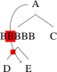
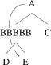

I *still* hate LaTeX, but I thought I'd share two tricks I found that help make syntax trees in `forest` look a little prettier.

## Looseness and cropping

Sometimes the contours of your arrows don't come out as "rounded" as they could be and you'll want to "let out the slack" a little.

```
\begin{forest}
    [A, name=start [B, name=end][C]]
    \draw[->, solid] (start) to[out=west, in=west] (end);
\end{forest}
```


The parameter that does this is called `looseness`. It defaults to 1, and bumping it up even a skosh to like 1.5 makes your arrows rounder and smoother.

```
\begin{forest}
    [A, name=start [B, name=end][C]]
    \draw[->, solid] (start) to[out=west, in=west, looseness=1.5] (end);
\end{forest}
```

{:.border}

Often, when you use loose arrows, or if you're manually messing with the Bezier curves yourself, LaTeX will put a bunch of whitespace next to your tree. I've given the above tree a border to show you how much whitespace it gave me. I suspect it has to do with the "control points" of the Bezier curve, which I guess have to be within bounds of the drawing? Here's how to crop it out.

```
\begin{adjustbox}{trim=0.8em 0 0 0,clip}
    \begin{forest}
        [A, name=start [B, name=end][C]]
        \draw[->, solid] (start) to[out=west, in=west, looseness=1.5] (end);
    \end{forest}
\end{adjustbox}
```

{:.border}

## Hiding overlaps

I've never actually seen anyone do this, as I suspect that using tricks like looseness to avoid overlapping are more popular. But here's how you can *hide* the portion of an arrow that overlaps another part of your tree.

Outside of your `forest` environment, you start by calling these three lines:

```
\pgfdeclarelayer{one}
\pgfdeclarelayer{two}
\pgfsetlayers{one,two,main}
```

These create three "layers" that stack vertically: `one` on the bottom, `two` on top of that, and `main` on top of that. (`main` is available by default.)

Whenever you draw something "normally", it goes on the `main` layer, and you draw on the other layers using `\begin{pgfonlayer}{one}`, for example.

```
\begin{forest}
    [A, name=start [BBBBB [D][E, name=end]][C]]
    before drawing tree={
        \begin{pgfonlayer}{one}
            \draw[->, solid] (start) to[out=west, in=135] (end);
        \end{pgfonlayer}
        \begin{pgfonlayer}{two}
            \fill[red] (-1.2,-1.4) rectangle (-0.8,-0.95);
            \fill[red] (-1,-1.7) rectangle (-0.8,-1.9);
        \end{pgfonlayer}
    }
\end{forest}
```

{:.bigger}

The way this works is I draw the arrow on the very bottom - layer `one`. Then, I draw rectangles above the arrow on layer `two`. With precise positioning I can cover up the parts of the arrow I need to. The tree goes on the very top - layer `main` - so that nothing in the tree gets covered up.

The image above, of course, shows you where the rectangles are by making them a bright, can't-miss-it red. But look what happens when you make the rectangles white, or even white with `opacity = 0.7` etc. This assumes you're using a white background - I don't have it in me to figure out how to get LaTex to actually erase the arrow!

{:.bigger} {:.bigger}

Thank you to Lauren Ackerman and Daniel Currie Hall!