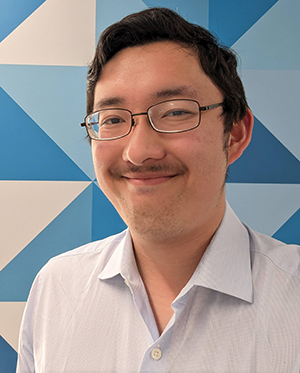

My [name](name) is Adam An [ædəm æn] (he/him). I'm a linguist at the University of Kansas where I am completing a PhD in linguistics and a Master's in computer science.

I work on morphosyntax, language variation and change, documentation, and revitalization. My current projects include:

* Social meaning of syntactic variation
* Information structure and the left periphery
* Grammaticalization and syntactic reconstruction
* Bantu morphosyntax and the *conjoint-disjoint* alternation, especially in Kinyarwanda
* Reconstruction and revitalization of Yesa:sahį́ (a.k.a. Tutelo-Saponi) (Siouan)
* Documentation of ChiNdau (Bantu)

**Email:** adamanlinguistics [at] gmail [dot] com or aan [at] ku [dot] edu

**Bluesky:** [@adamanlx.bsky.social](https://bsky.app/profile/adamanlx.bsky.social)

[More about me](about)
